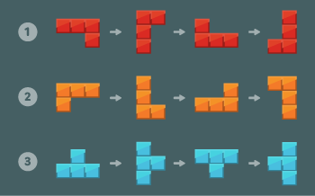
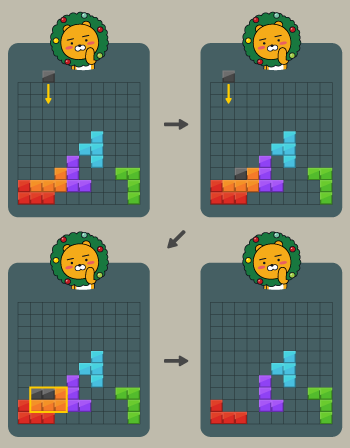
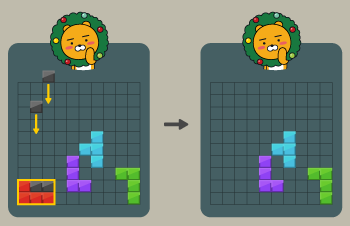
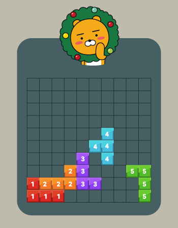

# 문제 설명

## 블록 게임

프렌즈 블록이라는 신규 게임이 출시되었고, 어마어마한 상금이 걸린 이벤트 대회가 개최 되었다.

이 대회는 사람을 대신해서 플레이할 프로그램으로 참가해도 된다는 규정이 있어서, 게임 실력이 형편없는 프로도는 프로그램을 만들어서 참가하기로 결심하고 개발을 시작하였다.

프로도가 우승할 수 있도록 도와서 빠르고 정확한 프로그램을 작성해 보자.

게임규칙

아래 그림과 같이 1×1 크기의 블록을 이어 붙여 만든 3 종류의 블록을 회전해서 총 12가지 모양의 블록을 만들 수 있다.

	

 

1 x 1 크기의 정사각형으로 이루어진 N x N 크기의 보드 위에 이 블록들이 배치된 채로 게임이 시작된다. (보드 위에 놓인 블록은 회전할 수 없다). 모든 블록은 블록을 구성하는 사각형들이 정확히 보드 위의 사각형에 맞도록 놓여있으며, 선 위에 걸치거나 보드를 벗어나게 놓여있는 경우는 없다.

플레이어는 위쪽에서 1 x 1 크기의 검은 블록을 떨어뜨려 쌓을 수 있다. 검은 블록은 항상 맵의 한 칸에 꽉 차게 떨어뜨려야 하며, 줄에 걸치면 안된다. 

이때, 검은 블록과 기존에 놓인 블록을 합해 속이 꽉 채워진 직사각형을 만들 수 있다면 그 블록을 없앨 수 있다.

예를 들어 검은 블록을 떨어뜨려 아래와 같이 만들 경우 주황색 블록을 없앨 수 있다.

	

 

빨간 블록을 가로막던 주황색 블록이 없어졌으므로 다음과 같이 빨간 블록도 없앨 수 있다.

	

 

그러나 다른 블록들은 검은 블록을 떨어뜨려 직사각형으로 만들 수 없기 때문에 없앨 수 없다.

따라서 위 예시에서 없앨 수 있는 블록은 최대 2개이다.

보드 위에 놓인 블록의 상태가 담긴 2차원 배열 board가 주어질 때, 검은 블록을 떨어뜨려 없앨 수 있는 블록 개수의 최댓값을 구하라.

 
 

### 제한사항

    •	board는 블록의 상태가 들어있는 N x N 크기 2차원 배열이다.
    ◦	N은 4 이상 50 이하다.
    •	board의 각 행의 원소는 0 이상 200 이하의 자연수이다.
    ◦	0 은 빈 칸을 나타낸다.
    ◦	board에 놓여있는 각 블록은 숫자를 이용해 표현한다.
    ◦	잘못된 블록 모양이 주어지는 경우는 없다.
    ◦	모양에 관계 없이 서로 다른 블록은 서로 다른 숫자로 표현됩니다.
    ◦	예를 들어 문제에 주어진 예시의 경우 다음과 같이 주어진다.

	

 
 

### 입출력 예

| board  | result |
| :------------ |:---------------:|
| [[0,0,0,0,0,0,0,0,0,0],  [0,0,0,0,0,0,0,0,0,0],  [0,0,0,0,0,0,0,0,0,0],  [0,0,0,0,0,0,0,0,0,0],   [0,0,0,0,0,0,4,0,0,0],  [0,0,0,0,0,4,4,0,0,0],  [0,0,0,0,3,0,4,0,0,0],  [0,0,0,2,3,0,0,0,5,5],  [1,2,2,2,3,3,0,0,0,5],  [1,1,1,0,0,0,0,0,0,5]] | 2|

### 추가 입출력 예

~~~

indata2 = [[0,0,0,0,0,0,0,0,0,0],
[0,0,0,0,0,0,0,0,0,0],
[0,0,0,0,0,0,0,0,0,0],
[0,0,0,0,0,0,0,0,0,0],
[0,0,0,0,0,0,4,0,0,0],
[0,0,0,0,0,4,4,0,0,0],
[0,0,0,2,3,0,4,0,0,0],
[0,2,2,2,3,0,0,0,5,5],
[1,0,0,0,3,3,0,0,0,5],
[1,1,1,0,0,0,0,0,0,5]]
result2 = 2

indata3 = [[0,0,0,0,0,0,0,0,0,0],
[0,0,0,0,0,0,0,0,0,0],
[0,0,0,0,0,0,0,0,0,0],
[0,0,0,0,0,0,0,0,0,0],
[0,0,0,0,0,0,4,0,0,0],
[0,0,0,0,0,4,4,4,0,0],
[0,0,0,2,3,0,0,0,0,0],
[0,2,2,2,3,0,0,0,5,5],
[1,0,0,0,3,3,6,0,0,5],
[1,1,1,0,0,6,6,6,0,5]]
result3 = 5

indata4 = [[0,0,0,0,0,0,0,0,0,0],
[0,0,0,0,0,0,0,0,0,0],
[0,0,0,0,0,0,0,0,0,0],
[0,0,0,0,0,0,0,0,0,0],
[7,7,7,0,0,0,4,0,0,0],
[0,7,0,0,0,4,4,4,0,0],
[0,0,0,2,3,0,0,0,0,0],
[0,2,2,2,3,0,0,0,5,5],
[1,0,0,0,3,3,6,0,0,5],
[1,1,1,0,0,6,6,6,0,5]]
result4 = 3

~~~

